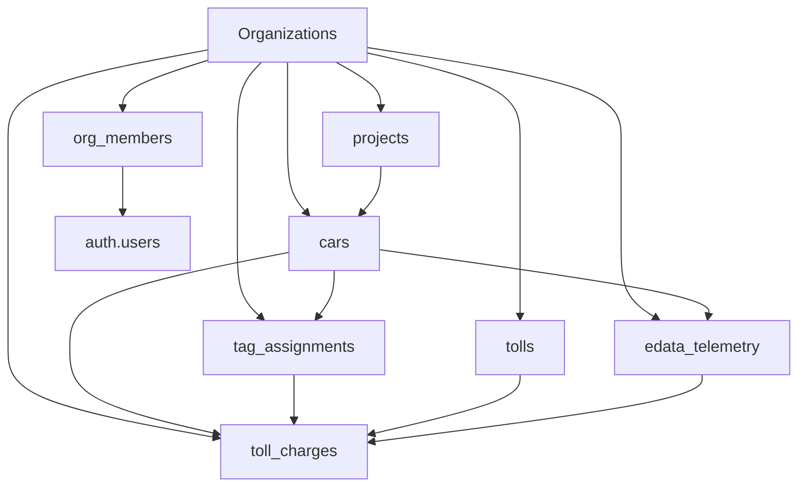

# Modelos de Datos

Esta sección explica en detalle la estructura de datos del sistema Paso Rápido, incluyendo las entidades principales, sus relaciones y propósitos específicos.

## Arquitectura de Datos

### Principios Fundamentales

<CardGroup cols={2}>
<Card title="Multi-Tenancia" icon="building">
**Aislamiento por Organización**

Cada organización tiene sus datos completamente separados mediante el campo `org_id` en todas las tablas principales.

- Seguridad garantizada entre organizaciones
- Escalabilidad horizontal
- Gestión independiente de datos
</Card>

<Card title="Trazabilidad" icon="clock">
**Auditoría Completa**

Todos los cambios importantes se registran con timestamps y usuarios responsables.

- Campos `created_at` y `updated_at`
- Historial de validaciones
- Registro de acciones de usuarios
</Card>
</CardGroup>

## Entidades Principales

### 1. Organizaciones

<Tabs>
<Tab title="Estructura">
```sql
organizations {
  id: UUID (Primary Key)
  name: TEXT
  avatar_url: TEXT
  created_at: TIMESTAMP
  updated_at: TIMESTAMP
  karma_api_url: TEXT
  karma_username: TEXT
  karma_password_encrypted: TEXT
}
```

**Propósito**: Entidad raíz que representa cada empresa cliente del sistema.
</Tab>

<Tab title="Campos Detallados">
<ParamField path="id" type="UUID" required>
Identificador único de la organización. Se genera automáticamente.
</ParamField>

<ParamField path="name" type="TEXT" required>
Nombre comercial de la empresa (ej: "Transportes ABC S.A.").
</ParamField>

<ParamField path="avatar_url" type="TEXT">
URL del logo o imagen corporativa para personalización de la interfaz.
</ParamField>

<ParamField path="karma_api_url" type="TEXT">
URL del servidor ERM Karma específico de la organización para obtener datos GPS.
</ParamField>

<ParamField path="karma_username" type="TEXT">
Usuario para autenticación con la API de ERM Karma.
</ParamField>

<ParamField path="karma_password_encrypted" type="TEXT">
Contraseña encriptada para la API de ERM Karma (nunca se almacena en texto plano).
</ParamField>
</Tab>

<Tab title="Relaciones">
**Una organización puede tener**:
- Múltiples usuarios (tabla `org_members`)
- Múltiples vehículos (tabla `cars`)
- Múltiples proyectos (tabla `projects`)
- Múltiples cargos de peaje (tabla `toll_charges`)
- Múltiples asignaciones de tags (tabla `tag_assignments`)

**Políticas de seguridad**:
- Los usuarios solo pueden ver datos de sus organizaciones
- Eliminación en cascada protege la integridad de datos
</Tab>
</Tabs>

### 2. Usuarios y Membresías

<Tabs>
<Tab title="Estructura">
```sql
org_members {
  org_id: UUID (FK → organizations.id)
  user_id: UUID (FK → auth.users.id)
  role: TEXT (OrgAdmin|Dispatcher|Analyst|Driver|ReadOnly)
  created_at: TIMESTAMP
  updated_at: TIMESTAMP
  PRIMARY KEY (org_id, user_id)
}
```

**Propósito**: Define qué usuarios pertenecen a cada organización y con qué nivel de acceso.
</Tab>

<Tab title="Roles Disponibles">
<AccordionGroup>
<Accordion title="OrgAdmin - Administrador">
**Permisos completos**:
- ✅ Gestionar usuarios y roles
- ✅ Configurar integraciones API
- ✅ Acceso a todos los módulos
- ✅ Generar cualquier reporte
- ✅ Modificar configuraciones del sistema
- ✅ Ver información financiera y estadísticas

**Casos de uso**: CEO, CTO, Gerente General
</Accordion>

<Accordion title="Analyst - Analista">
**Permisos operativos**:
- ✅ Ejecutar validaciones de cargos
- ✅ Revisar casos sospechosos
- ✅ Aprobar/rechazar cargos manualmente
- ✅ Generar reportes operativos
- ✅ Ver dashboards analíticos
- ❌ Modificar configuraciones del sistema

**Casos de uso**: Analista de Costos, Controller, Jefe de Operaciones
</Accordion>

<Accordion title="Dispatcher - Despachador">
**Permisos de flota**:
- ✅ Ver información de vehículos
- ✅ Consultar cargos de peajes
- ✅ Generar reportes básicos
- ✅ Gestionar asignaciones de tags
- ❌ Ejecutar validaciones
- ❌ Modificar estados de validación

**Casos de uso**: Despachador, Coordinador de Flota
</Accordion>

<Accordion title="ReadOnly - Solo Lectura">
**Permisos de consulta**:
- ✅ Ver dashboards
- ✅ Consultar reportes generados
- ✅ Acceso a información histórica
- ❌ Cualquier tipo de modificación
- ❌ Generar nuevos reportes

**Casos de uso**: Gerencia, Auditoría Externa, Consultores
</Accordion>
</AccordionGroup>
</Tab>
</Tabs>

### 3. Vehículos


<Tabs>
<Tab title="Estructura">
```sql
cars {
  car_id: BIGINT (Primary Key)
  device_id: BIGINT
  project_id: BIGINT (FK → projects.project_id)
  time_zone: TEXT
  car_number: TEXT
  license_plate: TEXT
  car_title: TEXT
  car_type: TEXT
  sub_type: TEXT
  car_year: TEXT
  car_color: TEXT
  sim_imsi: TEXT
  sim_phone: TEXT
  karma_video_data: TEXT
  fetch_timestamp: TIMESTAMP
  org_id: UUID (FK → organizations.id)
}
```

**Propósito**: Representa cada vehículo de la flota con su información técnica y administrativa.
</Tab>

<Tab title="Campos Detallados">
<ParamField path="car_id" type="BIGINT" required>
Identificador único del vehículo en el sistema ERM Karma. Este ID se sincroniza automáticamente.
</ParamField>

<ParamField path="device_id" type="BIGINT">
ID del dispositivo GPS instalado en el vehículo. Usado para correlacionar datos de telemetría.
</ParamField>

<ParamField path="project_id" type="BIGINT">
Referencia al proyecto al que pertenece el vehículo (permite agrupación lógica).
</ParamField>

<ParamField path="car_number" type="TEXT">
Número interno del vehículo asignado por la empresa (ej: "V-001", "Camión 15").
</ParamField>

<ParamField path="license_plate" type="TEXT">
Placa oficial del vehículo (ej: "ABC123"). Usado para matching con cargos de peaje.
</ParamField>

<ParamField path="car_title" type="TEXT">
Descripción o nombre personalizado del vehículo.
</ParamField>

<ParamField path="car_type" type="TEXT">
Tipo principal del vehículo (ej: "Camión", "Automóvil", "Motocicleta").
</ParamField>

<ParamField path="sub_type" type="TEXT">
Subtipo específico (ej: "Camión Rígido", "Sedán", "SUV").
</ParamField>

<ParamField path="sim_phone" type="TEXT">
Número telefónico del SIM card del dispositivo GPS (para comunicación directa).
</ParamField>

<ParamField path="fetch_timestamp" type="TIMESTAMP">
Última vez que se sincronizó la información del vehículo desde ERM Karma.
</ParamField>
</Tab>

<Tab title="Categorías de Vehículos">
Los vehículos se clasifican en categorías para determinar las tarifas de peaje:

<CardGroup cols={3}>
<Card title="Categoría 1" icon="car">
**Automóviles**
- Sedán, Hatchback
- SUV pequeños
- Motocicletas

*Tarifa más baja*
</Card>

<Card title="Categoría 2" icon="truck">
**Camionetas**
- Pickup
- SUV grandes
- Furgonetas

*Tarifa media-baja*
</Card>

<Card title="Categoría 3" icon="bus">
**Buses y Camiones Pequeños**
- Bus intermunicipal
- Camión rígido 2 ejes
- Furgón grande

*Tarifa media*
</Card>
</CardGroup>

<CardGroup cols={2}>
<Card title="Categoría 4" icon="truck">
**Camiones Medianos**
- Camión rígido 3+ ejes
- Tractomula sencilla

*Tarifa media-alta*
</Card>

<Card title="Categoría 5" icon="truck">
**Camiones Pesados**
- Tractomula con remolque
- Vehículos especiales

*Tarifa más alta*
</Card>
</CardGroup>

<Warning>
La categoría correcta es fundamental para la validación de montos. Una categoría incorrecta resultará en alertas de "cobro mayor" o "cobro menor".
</Warning>
</Tab>
</Tabs>

### 4. Asignaciones de Tags

<Tabs>
<Tab title="Estructura">
```sql
tag_assignments {
  id: BIGINT (Primary Key)
  date: DATE
  tag_number: INTEGER
  car_id: BIGINT (FK → cars.car_id)
  category: INTEGER (1-5)
  type: TEXT (corporativo|prepago)
  issued_at: DATE
  expires_at: DATE
  status: TEXT (Valido|Inhabilitado)
  created_at: TIMESTAMP
  updated_at: TIMESTAMP
  org_id: UUID (FK → organizations.id)
}
```

**Propósito**: Define qué tag está asignado a cada vehículo en un período específico.
</Tab>

<Tab title="Gestión de Asignaciones">
<Steps>
<Step title="Asignación Inicial">
Cuando se asigna un tag nuevo a un vehículo:

- Se crea un registro con fecha de inicio
- El tag debe estar en estado "Válido"
- La categoría debe coincidir con el tipo de vehículo
- Solo un tag por vehículo a la vez

<Check>
El sistema valida que no existan conflictos de asignación.
</Check>
</Step>

<Step title="Cambio de Asignación">
Para reasignar un tag a otro vehículo:

- Se marca la asignación anterior como terminada
- Se crea una nueva asignación con fecha de inicio
- Se mantiene el historial completo para auditoría

<Warning>
Los cargos históricos siguen vinculados a las asignaciones vigentes en su momento.
</Warning>
</Step>

<Step title="Inhabilitación">
Cuando un tag se pierde o daña:

- Se cambia el estado a "Inhabilitado"
- Se registra la fecha de inhabilitación
- Los cargos posteriores a esta fecha se marcan como sospechosos

<Note>
La inhabilitación no elimina el historial, solo previene uso futuro.
</Note>
</Step>
</Steps>
</Tab>

<Tab title="Estados y Tipos">
### Estados de Tag

<Tabs>
<Tab title="Válido">
**Descripción**: Tag activo y funcional.

**Características**:
- Permite paso por estaciones de peaje
- Genera cargos normales
- Validaciones GPS funcionan correctamente

**Indicador**: 🟢 Verde
</Tab>

<Tab title="Inhabilitado">
**Descripción**: Tag desactivado por pérdida, daño o fraude.

**Características**:
- No debería generar cargos nuevos
- Cargos posteriores a inhabilitación son sospechosos
- Requiere reemplazo físico del dispositivo

**Indicador**: 🔴 Rojo
</Tab>
</Tabs>

### Tipos de Tag

<CardGroup cols={2}>
<Card title="Corporativo" icon="building">
**Características**:
- Facturación mensual posterior
- Límite de crédito alto
- Gestión centralizada por la empresa
- Reportes detallados disponibles

**Ventajas**: Mejor control y reportes
</Card>

<Card title="Prepago" icon="credit-card">
**Características**:
- Saldo precargado
- Funciona hasta agotar saldo
- Recarga manual necesaria
- Control de gastos automático

**Ventajas**: Control de presupuesto estricto
</Card>
</CardGroup>
</Tab>
</Tabs>

### 5. Estaciones de Peaje

<Tabs>
<Tab title="Estructura">
```sql
tolls {
  id: BIGINT (Primary Key)
  name: TEXT
  latitude: DECIMAL(10,8)
  longitude: DECIMAL(11,8)
  category_1: BIGINT
  category_2: BIGINT
  category_3: BIGINT
  category_4: BIGINT
  category_5: BIGINT
  image: TEXT
  org_id: UUID (FK → organizations.id)
}
```

**Propósito**: Catálogo de estaciones de peaje con ubicación exacta y tarifas oficiales por categoría.
</Tab>

<Tab title="Información Geográfica">
### Precisión de Coordenadas

<Note>
Las coordenadas se almacenan con alta precisión (8 decimales para latitud, 11 para longitud) para garantizar validaciones GPS exactas.
</Note>

**Precisión alcanzada**:
- **Latitud**: ±1.1 metros aproximadamente
- **Longitud**: ±1.1 metros en el ecuador
- **Radio de validación**: Configurable (500m por defecto)

### Ejemplos de Estaciones

<AccordionGroup>
<Accordion title="Peaje Autopista Norte">
**Ubicación**: Km 45 Autopista Norte
- **Latitud**: 4.7110000
- **Longitud**: -74.0721000
- **Categoría 1**: $5,000
- **Categoría 2**: $8,000
- **Categoría 3**: $12,000
- **Categoría 4**: $16,000
- **Categoría 5**: $20,000
</Accordion>

<Accordion title="Peaje La Caro">
**Ubicación**: Autopista Norte Km 32
- **Latitud**: 4.8234567
- **Longitud**: -74.0456789
- **Categoría 1**: $4,500
- **Categoría 2**: $7,200
- **Categoría 3**: $10,800
- **Categoría 4**: $14,400
- **Categoría 5**: $18,000
</Accordion>
</AccordionGroup>
</Tab>

<Tab title="Tarifas y Validación">
### Estructura de Tarifas

Las tarifas se almacenan por categoría de vehículo:

<ParamField path="category_1" type="BIGINT">
Tarifa para automóviles y motocicletas (categoría más económica).
</ParamField>

<ParamField path="category_2" type="BIGINT">
Tarifa para camionetas y SUV.
</ParamField>

<ParamField path="category_3" type="BIGINT">
Tarifa para buses y camiones pequeños.
</ParamField>

<ParamField path="category_4" type="BIGINT">
Tarifa para camiones medianos.
</ParamField>

<ParamField path="category_5" type="BIGINT">
Tarifa para camiones pesados y vehículos especiales.
</ParamField>

### Proceso de Validación de Categoría

<Steps>
<Step title="Identificar Vehículo">
El sistema identifica el vehículo asociado al tag del cargo.
</Step>

<Step title="Determinar Categoría">
Basándose en el tipo de vehículo, determina la categoría correcta (1-5).
</Step>

<Step title="Consultar Tarifa Oficial">
Busca la tarifa oficial de la estación para esa categoría.
</Step>

<Step title="Comparar Montos">
Compara el monto cobrado vs. el monto esperado:
- **Iguales**: ✅ Correcto
- **Cobrado > Esperado**: ❌ Cobro excesivo
- **Cobrado < Esperado**: ⚠️ Cobro menor (favorable)
</Step>
</Steps>
</Tab>
</Tabs>

### 6. Cargos de Peaje

<Tabs>
<Tab title="Estructura">
```sql
toll_charges {
  id: BIGINT (Primary Key)
  date: TIMESTAMP
  amount: DOUBLE PRECISION
  tag: BIGINT
  station: TEXT
  type: TEXT
  matched_message_id: BIGINT
  is_duplicate: BOOLEAN
  duplicate_resolution: TEXT
  category_error: BOOLEAN
  expected_amount: DOUBLE PRECISION
  amount_difference: DOUBLE PRECISION
  tag_status_at_time: TEXT
  tag_status_error: BOOLEAN
  fraud_type: TEXT
  fraud_reasons: TEXT
  is_fraudulent: BOOLEAN
  fleet: TEXT
  validation_status: TEXT
  validation_details: TEXT
  matched_car_id: BIGINT (FK → cars.car_id)
  matched_license_plate: TEXT
  assignment_date_used: DATE
  distance_meters: DOUBLE PRECISION
  time_diff_minutes: DOUBLE PRECISION
  manual_revision_status: TEXT
  manual_revision_comment: TEXT
  created_at: TIMESTAMP
  updated_at: TIMESTAMP
  org_id: UUID (FK → organizations.id)
}
```

**Propósito**: Registro central de todos los cargos de peaje con sus validaciones y estados.
</Tab>

<Tab title="Campos de Validación">
### Validación GPS

<ParamField path="validation_status" type="TEXT">
Estado principal de validación GPS: VALIDO, UBICACION_INVALIDA, SIN_TELEMETRIA.
</ParamField>

<ParamField path="validation_details" type="TEXT">
Explicación detallada del resultado de validación (ej: "Vehículo a 1.2km de la estación").
</ParamField>

<ParamField path="matched_message_id" type="BIGINT">
ID del mensaje GPS que coincide temporalmente con el cargo.
</ParamField>

<ParamField path="distance_meters" type="DOUBLE PRECISION">
Distancia calculada entre la posición del vehículo y la estación de peaje.
</ParamField>

<ParamField path="time_diff_minutes" type="DOUBLE PRECISION">
Diferencia de tiempo entre el cargo y el mensaje GPS más cercano.
</ParamField>

### Validación de Duplicados

<ParamField path="is_duplicate" type="BOOLEAN">
Indica si se detectó otro cargo similar (mismo tag, estación, tiempo similar).
</ParamField>

<ParamField path="duplicate_resolution" type="TEXT">
Explicación de por qué se considera duplicado y qué acción tomar.
</ParamField>

### Validación de Categoría

<ParamField path="category_error" type="BOOLEAN">
Indica si hay discrepancia entre el monto cobrado y el esperado.
</ParamField>

<ParamField path="expected_amount" type="DOUBLE PRECISION">
Monto que debería haberse cobrado según la categoría del vehículo.
</ParamField>

<ParamField path="amount_difference" type="DOUBLE PRECISION">
Diferencia entre monto cobrado y esperado (positivo = cobro excesivo).
</ParamField>

### Validación de Tags

<ParamField path="tag_status_at_time" type="TEXT">
Estado del tag en el momento del cargo (Válido, Inhabilitado).
</ParamField>

<ParamField path="tag_status_error" type="BOOLEAN">
Indica si el tag estaba inhabilitado cuando se generó el cargo.
</ParamField>
</Tab>

<Tab title="Estados de Cargo">
### Ciclo de Vida de un Cargo

<Steps>
<Step title="Importación">
**Estado inicial**: Sin validar
- Datos básicos: fecha, tag, estación, monto
- Todos los campos de validación están vacíos
- Requiere procesamiento para determinar estado final

<Note>
Los cargos se importan desde archivos CSV proporcionados por las concesionarias.
</Note>
</Step>

<Step title="Matching con Vehículos">
**Proceso**: Asociación con flota
- Se busca la asignación de tag vigente en la fecha del cargo
- Se identifica el vehículo correspondiente
- Se establece el contexto para validaciones

<Warning>
Si no se encuentra asignación válida, el cargo queda como "huérfano" y requiere revisión.
</Warning>
</Step>

<Step title="Validación Automática">
**Proceso**: Ejecución de 4 validaciones
1. **GPS**: Confirma presencia del vehículo
2. **Duplicados**: Detecta cargos repetidos
3. **Categoría**: Verifica monto correcto
4. **Tag**: Confirma estado activo

<Check>
Cada validación actualiza campos específicos con resultados detallados.
</Check>
</Step>

<Step title="Revisión Manual (Opcional)">
**Proceso**: Intervención humana
- Analista revisa casos sospechosos
- Puede aprobar, rechazar o solicitar más información
- Agrega comentarios explicativos

<Tip>
La revisión manual es especialmente importante para cargos con múltiples validaciones fallidas.
</Tip>
</Step>

<Step title="Estado Final">
**Resultado**: Cargo procesado
- Estado de validación definitivo
- Recomendación de acción (pagar, reclamar, investigar)
- Documentación completa para auditoría

<Info>
Los cargos finalizados se incluyen en reportes y análisis de costos.
</Info>
</Step>
</Steps>
</Tab>
</Tabs>

### 7. Datos de Telemetría GPS

<Tabs>
<Tab title="Estructura">
```sql
edata_telemetry {
  car_id: BIGINT (FK → cars.car_id)
  device_id: BIGINT
  car_number: TEXT
  message_id: BIGINT
  edt: TIMESTAMP
  edt_tz: TEXT
  pdt: TEXT
  speed_kph: DOUBLE PRECISION
  odometer_km: DOUBLE PRECISION
  latitude: DOUBLE PRECISION
  longitude: DOUBLE PRECISION
  fetch_timestamp: TIMESTAMP
  batch_number: BIGINT
  org_id: UUID (FK → organizations.id)
}
```

**Propósito**: Almacena datos de telemetría GPS obtenidos desde ERM Karma para validaciones de ubicación.
</Tab>

<Tab title="Sincronización con ERM Karma">
### Proceso de Obtención de Datos

<Steps>
<Step title="Solicitud Automática">
**Trigger**: Importación de nuevos cargos
- Sistema identifica fechas de cargos sin validar
- Calcula ventana de tiempo necesaria (±2 horas por cargo)
- Solicita datos GPS a ERM Karma API

<Note>
La sincronización es automática pero puede ejecutarse manualmente si es necesario.
</Note>
</Step>

<Step title="Descarga por Lotes">
**Optimización**: Descarga eficiente
- Agrupa solicitudes por vehículo y rango de fechas
- Procesa en lotes de hasta 1000 registros
- Maneja reintentos automáticos en caso de falla

<Check>
Los datos se almacenan localmente para evitar solicitudes repetidas.
</Check>
</Step>

<Step title="Validación de Calidad">
**Control**: Verificación de datos
- Valida coordenadas dentro de rangos geográficos válidos
- Descarta registros con velocidades imposibles
- Marca registros con posibles errores de GPS

<Warning>
Datos GPS de mala calidad pueden afectar la precisión de las validaciones.
</Warning>
</Step>
</Steps>
</Tab>

<Tab title="Uso en Validaciones">
### Algoritmo de Validación GPS

<AccordionGroup>
<Accordion title="Paso 1: Búsqueda Temporal">
**Objetivo**: Encontrar mensajes GPS cercanos al momento del cargo

**Proceso**:
- Busca mensajes GPS en ventana de ±1 minuto (configurable)
- Si no encuentra, expande a ±5 minutos
- Ordena por proximidad temporal

**Criterio de éxito**: Al menos 1 mensaje GPS en ventana de tiempo
</Accordion>

<Accordion title="Paso 2: Cálculo de Distancia">
**Objetivo**: Medir distancia entre vehículo y estación

**Fórmula**: Distancia haversine entre coordenadas GPS
```
d = 2 * r * arcsin(√(sin²((lat2-lat1)/2) + cos(lat1) * cos(lat2) * sin²((lon2-lon1)/2)))
```

**Criterio de éxito**: Distancia ≤ 500 metros (configurable)
</Accordion>

<Accordion title="Paso 3: Validación de Coherencia">
**Objetivo**: Verificar que los datos sean lógicamente coherentes

**Verificaciones**:
- Velocidad dentro de rangos normales (0-120 km/h)
- Secuencia temporal coherente
- Ubicación geográficamente posible

**Criterio de éxito**: Todos los checks de coherencia pasan
</Accordion>

<Accordion title="Paso 4: Clasificación Final">
**Resultado**: Asignación de estado de validación

**Estados posibles**:
- **VALIDO**: Todas las validaciones exitosas
- **UBICACION_INVALIDA**: Distancia > umbral permitido
- **SIN_TELEMETRIA**: No hay datos GPS disponibles

**Documentación**: Se registran todos los detalles para auditoría
</Accordion>
</AccordionGroup>
</Tab>
</Tabs>

## Relaciones Entre Entidades

### Diagrama de Relaciones



### Flujo de Datos Principal

<Steps>
<Step title="Configuración Inicial">
**Entidades**: Organizations, Users, Cars, Projects
- Se crea la organización y usuarios
- Se importan vehículos y proyectos desde ERM Karma
- Se configura la integración API

<Check>
Base de datos preparada para operación.
</Check>
</Step>

<Step title="Gestión de Tags">
**Entidades**: tag_assignments, cars
- Se asignan tags a vehículos específicos
- Se define categoría y período de vigencia
- Se mantiene historial de cambios

<Note>
Las asignaciones correctas son críticas para validaciones precisas.
</Note>
</Step>

<Step title="Importación de Cargos">
**Entidades**: toll_charges, tolls
- Se importan cargos desde archivos CSV
- Se asocian con estaciones conocidas
- Se inicia proceso de validación

<Warning>
Cargos de estaciones desconocidas requieren configuración adicional.
</Warning>
</Step>

<Step title="Validación Automática">
**Entidades**: edata_telemetry, toll_charges
- Se obtienen datos GPS relevantes
- Se ejecutan algoritmos de validación
- Se actualizan estados y resultados

<Tip>
El proceso es automático pero puede monitorearse en tiempo real.
</Tip>
</Step>

<Step title="Revisión y Reportes">
**Entidades**: toll_charges (estados finales)
- Se revisan casos sospechosos manualmente
- Se generan reportes ejecutivos
- Se documentan decisiones para auditoría

<Info>
Los reportes pueden exportarse a Excel para análisis adicional.
</Info>
</Step>
</Steps>

## Integridad y Consistencia

### Restricciones de Negocio

<AccordionGroup>
<Accordion title="Unicidad de Tags">
**Regla**: Un tag solo puede estar asignado a un vehículo a la vez

**Implementación**: 
- Constraint único en (tag_number, org_id)
- Validación de fechas de asignación sin solapamiento
- Proceso de reasignación controlado

**Excepción**: Tags inhabilitados pueden reasignarse después de reemplazo físico
</Accordion>

<Accordion title="Consistencia Temporal">
**Regla**: Los cargos solo pueden validarse con datos GPS contemporáneos

**Implementación**:
- Ventana de tiempo configurable para matching
- Validación de timestamps coherentes
- Manejo de zonas horarias

**Consideración**: Diferencias de reloj entre sistemas pueden requerir ajustes
</Accordion>

<Accordion title="Aislamiento de Organizaciones">
**Regla**: Los datos de una organización nunca deben ser visibles para otra

**Implementación**:
- Row Level Security (RLS) en todas las tablas
- Filtrado automático por org_id
- Validación de permisos en cada consulta

**Garantía**: Seguridad certificada a nivel de base de datos
</Accordion>
</AccordionGroup>

### Políticas de Retención

<Tabs>
<Tab title="Datos Operativos">
**Período**: 2 años mínimo
- Cargos de peaje y validaciones
- Datos GPS de telemetría
- Asignaciones de tags

**Justificación**: Auditoría, análisis histórico, disputas legales
</Tab>

<Tab title="Logs de Sistema">
**Período**: 6 meses
- Logs de importación
- Registros de validación
- Errores y excepciones

**Justificación**: Troubleshooting, optimización de procesos
</Tab>

<Tab title="Reportes Generados">
**Período**: Permanente
- Reportes ejecutivos mensuales
- Análisis de fraudes
- Documentación de decisiones

**Justificación**: Histórico empresarial, compliance regulatorio
</Tab>
</Tabs>

## Próximos Pasos

<CardGroup cols={2}>
<Card title="Sistema de Validación" icon="shield" href="/validacion-sistema">
Aprende cómo funcionan los algoritmos de validación en detalle
</Card>
<Card title="Guía del Usuario" icon="user" href="/guia-usuario">
Instrucciones prácticas para operar el sistema día a día
</Card>
</CardGroup> 