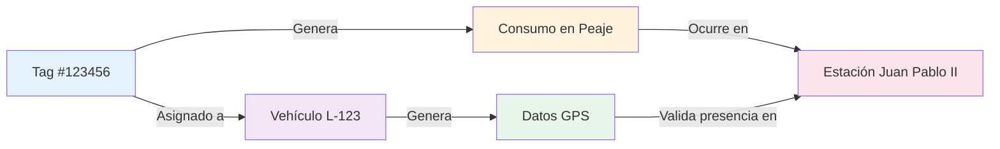

# Conceptos Fundamentales

Antes de comenzar a trabajar con el módulo Paso Rápido, es importante familiarizarse con los conceptos clave que forman la base del sistema. Esta sección explica los elementos fundamentales con los que trabajará en su día a día.

## Consumos de Paso Rápido

### ¿Qué es un Consumo?

Un **consumo** (también llamado "cargo" o "transacción de peaje") es el registro de un pase de vehículo por una caseta de peaje. Cada vez que un tag atraviesa una estación de peaje, el sistema genera automáticamente un consumo que incluye:

- **Fecha y hora** del paso
- **Número de tag** que realizó el paso
- **Estación de peaje** donde ocurrió
- **Monto cobrado** según la categoría
- **Tipo de transacción** (generalmente "PASE")

### Origen de los Consumos

Los consumos provienen directamente de los operadores de peaje (Autopistas, OISOE, etc.) y son importados al sistema mediante archivos Excel proporcionados por estas entidades. Estos archivos típicamente contienen:

- Resúmenes mensuales de consumos por tag
- Detalles de cada transacción individual
- Información de facturación

<Warning>
Los consumos reflejan lo que el operador de peaje ha facturado a su empresa. No siempre son correctos, por eso es necesario validarlos contra sus propios registros de asignación de tags y datos de GPS.
</Warning>

### ¿Por Qué Auditar los Consumos?

La auditoría de consumos es crítica porque:

1. **Cobros duplicados**: A veces el sistema de peaje registra el mismo pase dos veces
2. **Errores de categoría**: El tag puede estar categorizado incorrectamente, resultando en sobrecargos
3. **Tags perdidos o robados**: Detectar uso no autorizado de tags
4. **Tags vencidos**: Identificar cargos después de que un tag fue dado de baja
5. **Optimización de rutas**: Entender patrones de uso para reducir costos

Un estudio interno reveló que entre el 2% y 5% de los consumos de peaje presentan algún tipo de irregularidad. En una flota de 100 vehículos con gastos mensuales de RD$500,000 en peajes, esto representa entre RD$10,000 y RD$25,000 mensuales que pueden recuperarse mediante auditorías efectivas.

## Tags de Peaje

### ¿Qué es un Tag?

Un **tag** es un dispositivo electrónico de identificación por radiofrecuencia (RFID) que se adhiere al parabrisas del vehículo. Cuando el vehículo pasa por una caseta de peaje equipada con tecnología de paso rápido, los lectores identifican el tag y registran automáticamente el paso sin necesidad de detenerse.


### Tipos de Tags

El sistema maneja dos tipos principales de tags:

#### Tags Corporativos

- **Características**: Vinculados a una cuenta corporativa con facturación mensual
- **Ventajas**: No requieren recargas, límite de crédito amplio, consolidación de facturación
- **Uso recomendado**: Vehículos de uso frecuente, flota permanente
- **Control**: Requieren mayor supervisión por el riesgo de uso no autorizado

#### Tags Prepago

- **Características**: Deben recargarse periódicamente con saldo
- **Ventajas**: Mayor control del gasto, límite natural de uso
- **Uso recomendado**: Vehículos ocasionales, contratistas temporales, vehículos personales autorizados
- **Control**: El saldo actúa como mecanismo de control automático

<Tip>
Una estrategia común es usar tags corporativos para la flota principal y tags prepago para vehículos especiales o de uso eventual. Esto optimiza la gestión sin sacrificar el control.
</Tip>

### Categorías de Tags

Cada tag está asociado a una categoría vehicular (1 a 5) que determina la tarifa de peaje. Esta categorización debe coincidir con el tipo de vehículo al que está asignado:

| Categoría | Tipo de Vehículo | Ejemplo de Tarifa* |
|-----------|------------------|-------------------|
| **Cat. 1** | Automóviles, jeeps, camionetas | RD$ 100 - 150 |
| **Cat. 2** | Autobuses pequeños, camiones 2 ejes | RD$ 150 - 250 |
| **Cat. 3** | Autobuses grandes, camiones 3 ejes | RD$ 200 - 350 |
| **Cat. 4** | Camiones de 4 ejes | RD$ 300 - 500 |
| **Cat. 5** | Camiones de 5+ ejes | RD$ 400 - 600 |

<Note>
*Las tarifas varían según la estación de peaje. Los montos mostrados son aproximados y solo con fines ilustrativos.
</Note>

### Estados del Tag

Un tag puede encontrarse en dos estados:

#### Válido
- El tag está activo y autorizado para generar cargos
- Los consumos con tags válidos son esperados y normales
- Estado predeterminado de un tag recién asignado

#### Inhabilitado
- El tag ha sido desactivado por alguna razón
- Cualquier consumo con un tag inhabilitado es sospechoso
- Razones comunes de inhabilitación:
  - Tag perdido o robado
  - Vehículo dado de baja
  - Tag dañado o defectuoso
  - Fin de contrato con el proveedor
  - Cambio de operador

<Warning>
**Importante**: Si detecta consumos con un tag marcado como "Inhabilitado" en la fecha del cargo, estos son alta prioridad para reclamo. Indican uso no autorizado o error del sistema del operador.
</Warning>

## Asignación de Tags

### ¿Qué es una Asignación?

Una **asignación de tag** es el registro que vincula un tag específico a un vehículo particular durante un período de tiempo definido. Este registro es la base de la auditoría porque permite:

- Saber qué vehículo debería estar generando qué consumos
- Validar que los consumos corresponden al vehículo correcto
- Cruzar datos de GPS del vehículo con los consumos del tag
- Identificar usos no autorizados

### Componentes de una Asignación

Cada asignación contiene la siguiente información:

| Campo | Descripción | Ejemplo |
|-------|-------------|---------|
| **Tag Number** | Número identificador del tag | 123456 |
| **Vehículo** | A qué vehículo está asignado | Camión L-123 |
| **Categoría** | Categoría de peaje (1-5) | 2 |
| **Tipo** | Corporativo o Prepago | Corporativo |
| **Estado** | Válido o Inhabilitado | Válido |
| **Fecha de Asignación** | Cuándo se asignó el tag | 15/01/2026 |
| **Fecha de Emisión** | Cuándo se activó el tag | 10/01/2026 |
| **Fecha de Vencimiento** | Cuándo expira (opcional) | 31/12/2026 |
| **Grupo** | Categoría organizacional (opcional) | Transporte |

### Tipos de Vehículos en Asignaciones

El sistema distingue dos tipos de vehículos:

#### Vehículos con GPS
- Forman parte de la flota con sistema de telemetría ERM
- Permiten validación GPS automática
- Se seleccionan de la lista de vehículos en el sistema
- Datos vinculados: número de unidad, placa, proyecto

#### Vehículos sin GPS
- No tienen telemetría activa
- Información ingresada manualmente
- Campos requeridos: nombre del vehículo y placa
- Limitación: no se puede realizar validación GPS

<Tip>
Para vehículos de uso frecuente, es altamente recomendable instalar dispositivos GPS. La inversión se recupera rápidamente gracias a la capacidad de validar automáticamente todos los consumos y detectar irregularidades.
</Tip>

### Grupos de Asignación

El campo **Grupo** (también llamado `assignment_category`) permite organizar las asignaciones en categorías empresariales, facilitando reportes segmentados. Ejemplos comunes:

- **Transporte**: Vehículos dedicados al transporte de carga
- **Logística**: Vehículos de distribución y entregas
- **Administrativo**: Vehículos de uso ejecutivo u oficina
- **Mantenimiento**: Vehículos de soporte técnico
- **Operaciones**: Vehículos de supervisión de campo

Esta organización es especialmente útil al generar reportes para diferentes departamentos o centros de costo.

### Período de Validez

Cada asignación tiene un rango de fechas que define cuándo es válida:

```
Fecha de Emisión → Fecha de Asignación → Fecha de Vencimiento
      ↓                    ↓                      ↓
   Tag activado      Tag físicamente        Tag debe ser
   en el sistema     instalado en          devuelto/
                     el vehículo           desactivado
```

**Comportamiento del sistema de validación**:
- ✅ Consumos entre "Fecha de Asignación" y "Fecha de Vencimiento": **Válidos**
- ⚠️ Consumos antes de "Fecha de Asignación": **Sospechosos** (posible uso previo no autorizado)
- ⚠️ Consumos después de "Fecha de Vencimiento": **Sospechosos** (uso después de devolución)
- ❌ Consumos con tag en estado "Inhabilitado": **Alta prioridad para reclamo**

## Estaciones de Peaje

### Red de Peajes

República Dominicana cuenta con una red de casetas de peaje distribuida a lo largo de las principales carreteras y autopistas. El sistema almacena información de cada estación para facilitar el análisis geográfico y la validación GPS.

### Información de Estación

Para cada estación de peaje, el sistema mantiene:

- **Nombre**: Identificación de la caseta (ej: "Juan Pablo II", "Las Américas")
- **Código**: Identificador numérico utilizado en los consumos
- **Ubicación GPS**: Coordenadas (latitud, longitud) exactas
- **Operador**: Empresa que administra la caseta
- **Tarifas por categoría**: Tabla de precios para cada tipo de vehículo

### Uso en Validaciones

La información de las estaciones es fundamental para dos validaciones clave:

1. **Validación GPS**: El sistema verifica que el vehículo asignado al tag estuvo físicamente cerca de la estación en el momento del cargo (dentro de un radio razonable y ventana de tiempo)

2. **Validación de Categoría**: El sistema confirma que el monto cobrado corresponde a la tarifa correcta para la categoría del tag en esa estación específica


## Relación Entre Conceptos

Para comprender el sistema completo, es útil visualizar cómo se relacionan estos conceptos:



**Flujo de auditoría**:
1. Un **Tag** está **asignado** a un **Vehículo** específico
2. El **Vehículo** genera **Datos GPS** mientras opera
3. El **Tag** genera **Consumos** al pasar por peajes
4. Cada **Consumo** ocurre en una **Estación** con ubicación conocida
5. El sistema **valida** que los **Datos GPS** confirman que el **Vehículo** estuvo en la **Estación** en el momento del **Consumo**

## Ejemplos Prácticos

### Ejemplo 1: Asignación Normal

**Situación**:
- Tag #456789 (Categoría 2, Corporativo, Estado: Válido)
- Asignado a: Camión L-234
- Fecha de asignación: 01/02/2026
- Consumo registrado: 15/02/2026, 10:30 AM, Estación Las Américas, RD$ 200

**Validación**:
- ✅ Fecha dentro del período de validez
- ✅ Tag en estado válido
- ✅ GPS confirma que L-234 pasó por Las Américas a las 10:28 AM (2 min diferencia)
- ✅ Monto RD$ 200 coincide con tarifa Cat. 2 en esa estación
- **Resultado**: Consumo válido, sin irregularidades

### Ejemplo 2: Detección de Problema

**Situación**:
- Tag #789012 (Categoría 1, Corporativo, Estado: Inhabilitado desde 10/02/2026)
- Antes asignado a: Jeep J-567 (vendido el 09/02/2026)
- Consumo registrado: 18/02/2026, 3:45 PM, Estación Duarte, RD$ 120

**Validación**:
- ❌ Tag estaba inhabilitado en la fecha del consumo
- ❌ Vehículo ya no pertenece a la empresa
- ⚠️ No hay datos GPS (vehículo vendido)
- **Resultado**: Consumo sospechoso - **Alta prioridad para reclamo**
- **Acción recomendada**: Solicitar revisión del cargo y posiblemente devolución, ya que el tag debió estar inactivo

### Ejemplo 3: Error de Categoría

**Situación**:
- Tag #345678 (Categoría 1, Corporativo, Estado: Válido)
- Asignado a: Automóvil A-890
- Consumo registrado: 20/02/2026, 8:15 AM, Estación San Cristóbal, RD$ 250

**Validación**:
- ✅ Tag en estado válido
- ✅ GPS confirma presencia del vehículo
- ❌ Monto RD$ 250 NO coincide con tarifa Cat. 1 (debió ser RD$ 130)
- **Diferencia**: RD$ 120 de sobrecargo
- **Resultado**: Consumo con error de categoría
- **Acción recomendada**: Reclamo por diferencia de RD$ 120

## Conclusión

Estos conceptos fundamentales son la base sobre la cual funciona todo el módulo Paso Rápido. Al comprender qué son los consumos, tags, asignaciones y estaciones, usted estará preparado para:

- Gestionar correctamente las asignaciones de tags
- Interpretar los resultados de las validaciones
- Identificar rápidamente irregularidades
- Tomar decisiones informadas sobre reclamos
- Generar reportes significativos

En las siguientes secciones de este manual, profundizaremos en cómo usar estas herramientas en la práctica.

---

**Próximos pasos**: Continúe con [Gestión de Tags](/paso-rapido/gestion-tags) para aprender cómo crear y administrar asignaciones de tags en el sistema.
