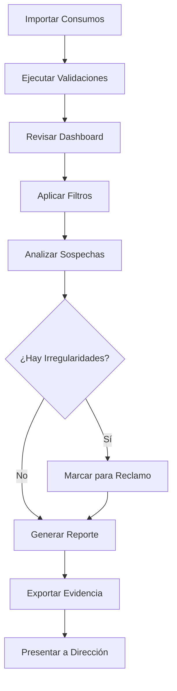

# Manual de Usuario: Módulo Paso Rápido

Bienvenido al manual de usuario del módulo Paso Rápido de United Logistics. Este manual ha sido diseñado específicamente para el equipo de auditoría y proporciona una guía completa sobre cómo utilizar el sistema para la gestión, validación y análisis de consumos en las casetas de peaje de República Dominicana.

## ¿Qué es el Módulo Paso Rápido?

El módulo Paso Rápido es un sistema integral de auditoría que permite a su organización:

- **Gestionar tags de peaje**: Controlar las asignaciones de tags corporativos y prepago a los vehículos de su flota
- **Validar consumos automáticamente**: Verificar la legitimidad de cada cargo mediante cuatro tipos de validaciones cruzadas
- **Detectar irregularidades**: Identificar duplicados, cobros incorrectos, uso indebido de tags y otras anomalías
- **Generar reportes detallados**: Crear informes completos en PDF para análisis ejecutivo y presentaciones
- **Gestionar reclamos**: Documentar y dar seguimiento a cargos que requieren disputa ante los operadores de peaje

## Contexto: Sistema de Peajes en República Dominicana

En República Dominicana, el sistema de peajes opera mediante tecnología de paso rápido que permite el tránsito vehicular sin detenerse. Los tags (dispositivos electrónicos adheridos al parabrisas) se comunican con los lectores en las casetas de peaje, registrando automáticamente cada paso y generando un cargo según la categoría del vehículo.

### Categorías de Peaje

El sistema clasifica los vehículos en cinco categorías, cada una con una tarifa diferente:

- **Categoría 1**: Automóviles, jeeps y camionetas pequeñas
- **Categoría 2**: Autobuses pequeños, camiones de 2 ejes
- **Categoría 3**: Autobuses grandes, camiones de 3 ejes
- **Categoría 4**: Camiones de 4 ejes
- **Categoría 5**: Camiones de 5 o más ejes

<Note>
Las tarifas varían según la estación de peaje. Un mismo vehículo puede tener diferentes cargos dependiendo de qué caseta cruce.
</Note>

## Objetivos del Sistema de Auditoría

El módulo Paso Rápido fue desarrollado para ayudar a las empresas con flotas vehiculares a:

1. **Reducir gastos operativos**: Identificando cobros duplicados, errores de categoría y uso no autorizado de tags
2. **Mejorar el control**: Manteniendo un registro preciso de qué vehículo usa qué tag y cuándo
3. **Facilitar reclamos**: Documentando evidencia sólida (GPS, asignaciones, validaciones) para disputar cargos incorrectos
4. **Optimizar rutas**: Analizando patrones de consumo para identificar oportunidades de ahorro
5. **Prevenir fraude**: Detectando automáticamente anomalías que podrían indicar uso indebido

## Estructura de Este Manual

Este manual está organizado en secciones que le guiarán desde los conceptos básicos hasta las funciones avanzadas:

<CardGroup cols={2}>
  <Card title="Conceptos Fundamentales" icon="book" href="/paso-rapido/conceptos-fundamentales">
    Entienda qué son los consumos, tags y asignaciones
  </Card>
  
  <Card title="Gestión de Tags" icon="tag" href="/paso-rapido/gestion-tags">
    Aprenda a crear y administrar tags de peaje
  </Card>
  
  <Card title="Gestión de Consumos" icon="credit-card" href="/paso-rapido/gestion-consumos">
    Trabaje con los cargos de peaje en el sistema
  </Card>
  
  <Card title="Sistema de Validaciones" icon="shield-check" href="/paso-rapido/validaciones">
    Comprenda las cuatro validaciones automáticas
  </Card>
  
  <Card title="Filtros y Búsqueda" icon="filter" href="/paso-rapido/filtros-busqueda">
    Encuentre información específica rápidamente
  </Card>
  
  <Card title="Interpretación de Resultados" icon="chart-line" href="/paso-rapido/interpretacion-resultados">
    Lea y analice los datos del dashboard
  </Card>
  
  <Card title="Reporte PDF" icon="file-pdf" href="/paso-rapido/reporte-pdf">
    Genere e interprete el informe ejecutivo completo
  </Card>
  
  <Card title="Exportación de Datos" icon="download" href="/paso-rapido/exportacion">
    Exporte información a Excel para análisis externo
  </Card>
  
  <Card title="Gestión de Reclamos" icon="exclamation-triangle" href="/paso-rapido/reclamos">
    Documente y gestione disputas de cargos
  </Card>
  
  <Card title="Importación de Datos" icon="upload" href="/paso-rapido/importacion">
    Cargue consumos desde archivos Excel
  </Card>
</CardGroup>

## Primeros Pasos

Si es su primera vez utilizando el módulo Paso Rápido, le recomendamos seguir este orden:

1. Lea la sección de [Conceptos Fundamentales](/paso-rapido/conceptos-fundamentales) para familiarizarse con la terminología
2. Revise la [Gestión de Tags](/paso-rapido/gestion-tags) para entender cómo se asignan los tags a los vehículos
3. Explore el [Sistema de Validaciones](/paso-rapido/validaciones) para comprender cómo el sistema detecta irregularidades
4. Practique con los [Filtros y Búsqueda](/paso-rapido/filtros-busqueda) para navegar los datos eficientemente
5. Genere su primer [Reporte PDF](/paso-rapido/reporte-pdf) para ver el análisis completo

## Flujo de Trabajo Típico

Un ciclo de auditoría típico con el módulo Paso Rápido sigue estos pasos:

<Tip>
Ejecute las validaciones semanalmente para mantener un control constante sobre los consumos de su flota. Esto facilita la identificación temprana de problemas y hace más efectiva la gestión de reclamos.
</Tip>

## Soporte y Asistencia

Si tiene preguntas sobre el uso del módulo Paso Rápido o encuentra algún problema:

- **Soporte Técnico**: sfuentes@solidarityagents.com
- **Acceso al Sistema**: [United Logistics Portal](https://unitedpetroleum.app)

---

**Última actualización**: Febrero 2026
