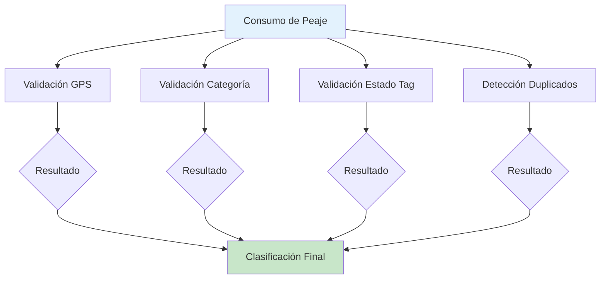

# Sistema de Validaciones

El corazón del módulo Paso Rápido es su sistema de validaciones automáticas que cruza información de múltiples fuentes para detectar irregularidades. Esta sección explica en detalle cómo funciona cada validación y cómo interpretar sus resultados.

## Visión General

El sistema ejecuta **cuatro validaciones independientes** sobre cada consumo de peaje:

1. **Validación GPS (Ubicación)**: ¿El vehículo asignado al tag estuvo físicamente cerca del peaje?
2. **Validación de Categoría**: ¿El monto cobrado corresponde a la categoría del tag?
3. **Validación de Estado del Tag**: ¿El tag estaba activo y válido en la fecha del cargo?
4. **Detección de Duplicados**: ¿Es este cargo un duplicado de otra transacción?

Cada validación opera de manera independiente, lo que significa que un consumo puede pasar algunas validaciones y fallar otras. La combinación de resultados proporciona una imagen completa de la legitimidad del cargo.



## Validación 1: GPS (Ubicación)

### ¿Qué Valida?

Esta validación verifica que el vehículo asignado al tag estuvo físicamente presente cerca de la estación de peaje en el momento aproximado del cargo.

### ¿Cómo Funciona?

El sistema ejecuta el siguiente proceso:

1. **Identificar el vehículo**: Busca qué vehículo tenía asignado el tag en la fecha del consumo
2. **Obtener ubicación del peaje**: Consulta las coordenadas GPS de la estación de peaje
3. **Buscar registros GPS del vehículo**: Recupera los puntos de telemetría del vehículo en una ventana de tiempo alrededor del cargo
4. **Calcular distancias**: Mide la distancia entre cada punto GPS y la ubicación del peaje
5. **Encontrar el punto más cercano**: Identifica el registro GPS más cercano en distancia y tiempo
6. **Evaluar criterios**: Compara contra los márgenes de tolerancia establecidos

### Criterios de Validación


**Parámetros de evaluación**:

| Criterio | Valor | Descripción |
|----------|-------|-------------|
| **Ventana de tiempo** | ±30 minutos | Busca registros GPS 30 min antes y después del cargo |
| **Distancia VÁLIDA** | ≤ 500 metros | Dentro de este radio, se considera válido |
| **Distancia IMPRECISA** | 500m - 2km | Cerca pero fuera del margen ideal |
| **Distancia INVÁLIDA** | > 2km | Demasiado lejos, posible irregularidad |
| **Diferencia de tiempo ideal** | ≤ 10 minutos | Tiempo aceptable entre GPS y cargo |

### Resultados Posibles

#### VÁLIDO ✅

**Significa**: El vehículo estuvo comprobadamente cerca del peaje en el momento correcto.

**Criterios**:
- Distancia ≤ 500 metros
- Diferencia de tiempo ≤ 10 minutos
- Datos GPS de buena calidad

**Ejemplo**:
```
Cargo: 15/02/2026 10:30 AM, Estación Las Américas
GPS:   15/02/2026 10:28 AM, 350 metros del peaje
→ Resultado: VÁLIDO (2 min, 350m)
```

**Interpretación**: Consumo legítimo, el vehículo definitivamente pasó por el peaje.

#### UBICACIÓN_INVÁLIDA ❌

**Significa**: El vehículo NO estaba cerca del peaje en el momento del cargo.

**Criterios**:
- Distancia > 2km
- O no hay registros GPS en la ventana de tiempo

**Ejemplo**:
```
Cargo: 15/02/2026 10:30 AM, Estación Las Américas (Santo Domingo)
GPS:   15/02/2026 10:32 AM, 25 km del peaje (en Santiago)
→ Resultado: UBICACIÓN_INVÁLIDA (2 min, 25km)
```

**Interpretación**: Alta probabilidad de irregularidad. Posibles causas:
- Tag usado en vehículo diferente al asignado
- Tag clonado o robado
- Error en la asignación (tag en vehículo incorrecto)
- Dispositivo GPS reportando ubicación incorrecta (raro)

**Acción recomendada**: Investigación prioritaria y probable reclamo.

#### UBICACIÓN_IMPRECISA ⚠️

**Significa**: El vehículo estaba relativamente cerca pero fuera del margen ideal.

**Criterios**:
- Distancia entre 500m y 2km
- O diferencia de tiempo entre 10 y 30 minutos

**Ejemplo**:
```
Cargo: 15/02/2026 10:30 AM, Estación Las Américas
GPS:   15/02/2026 10:45 AM, 1.2 km del peaje
→ Resultado: UBICACIÓN_IMPRECISA (15 min, 1.2km)
```

**Interpretación**: Posiblemente válido pero requiere consideración. Causas comunes:
- Tráfico pesado (el vehículo pasó pero avanzó lento)
- Dispositivo GPS con delay en reporte
- Coordenadas del peaje ligeramente imprecisas en el sistema
- El vehículo estaba en una ruta cercana

**Acción recomendada**: Revisar individualmente casos de alto valor o patrones sospechosos.

#### SIN_TELEMETRÍA ⚪

**Significa**: No hay datos GPS disponibles para validar el consumo.

**Causas**:
- Vehículo sin dispositivo GPS instalado
- Dispositivo desconectado o sin batería
- Área sin cobertura celular (datos no se transmitieron)
- Período en que el GPS estuvo apagado

**Ejemplo**:
```
Cargo: 15/02/2026 10:30 AM, Estación Las Américas
GPS:   (Sin registros en ventana de tiempo)
→ Resultado: SIN_TELEMETRÍA
```

**Interpretación**: No se puede confirmar ni descartar. El consumo podría ser válido o inválido.

**Acción recomendada**: 
- Validar mediante otros métodos (registros de despacho, bitácoras del conductor)
- Revisar otras validaciones (categoría, duplicados, estado del tag)
- Para vehículos de uso frecuente, considerar instalación/reparación de GPS

<Note>
**Importante**: SIN_TELEMETRÍA no significa "inválido". Simplemente indica que esta validación particular no se puede ejecutar. El consumo aún puede ser legítimo.
</Note>

### Casos Especiales

#### Múltiples Vehículos Cerca

Si varios vehículos de su flota pasaron por el mismo peaje cerca del mismo momento, el sistema:
- Selecciona el vehículo asignado al tag específico
- Ignora los otros vehículos (aunque estén más cerca)
- La validación se basa en el vehículo correcto según la asignación

#### Tags en Vehículos sin GPS

Si el tag está asignado a un vehículo que no tiene GPS (registrado manualmente con nombre y placa):
- La validación siempre retorna SIN_TELEMETRÍA
- Es necesario validar por otros medios
- Se recomienda fuertemente instalar GPS en estos vehículos si tienen consumo frecuente

## Validación 2: Categoría

### ¿Qué Valida?

Esta validación verifica que el monto cobrado corresponde a la tarifa correcta según la categoría del tag y la estación de peaje específica.

### ¿Cómo Funciona?

El sistema ejecuta este proceso:

1. **Obtener categoría del tag**: Consulta la categoría (1-5) asignada al tag
2. **Identificar la estación**: Determina en qué caseta de peaje ocurrió el cargo
3. **Consultar tarifa esperada**: Busca en la tabla de precios el monto que debería cobrarse para esa categoría en esa estación
4. **Comparar montos**: Compara el monto real cobrado vs. el monto esperado
5. **Calcular diferencia**: Determina si hay sobrecargo o descuento


### Tabla de Precios

El sistema mantiene una tabla de precios actualizada para cada estación de peaje. Ejemplo simplificado:

| Estación | Cat. 1 | Cat. 2 | Cat. 3 | Cat. 4 | Cat. 5 |
|----------|--------|--------|--------|--------|--------|
| **Las Américas** | $130 | $200 | $300 | $450 | $550 |
| **Juan Pablo II** | $100 | $150 | $250 | $350 | $450 |
| **San Cristóbal** | $120 | $180 | $280 | $420 | $520 |

<Note>
Los precios varían por estación y pueden cambiar periódicamente. El sistema se actualiza cuando los operadores notifican cambios de tarifas.
</Note>

### Resultados Posibles

#### Monto Correcto ✅

**Significa**: El monto cobrado coincide exactamente con la tarifa esperada.

**Ejemplo**:
```
Tag Categoría: 2
Estación: Las Américas
Monto cobrado: $200
Monto esperado: $200
Diferencia: $0
→ Resultado: VÁLIDO
```

**Interpretación**: El cobro es correcto, sin irregularidades de categoría.

#### Cobro Mayor (Sobrecargo) ⚠️

**Significa**: Se cobró más de lo debido según la categoría del tag.

**Ejemplo**:
```
Tag Categoría: 1
Estación: Las Américas
Monto cobrado: $200
Monto esperado: $130
Diferencia: +$70 (sobrecargo)
→ Resultado: ERROR DE CATEGORÍA (cobro mayor)
```

**Posibles causas**:
1. **Tag mal categorizado**: El tag dice Categoría 1 pero el sistema del peaje lo lee como Categoría 2
2. **Cambio de vehículo**: El tag fue movido a un vehículo de mayor categoría sin actualizar el registro
3. **Error del operador**: Categorización incorrecta en el sistema del peaje
4. **Categoría desactualizada**: El vehículo fue modificado (ej: agregaron ejes) pero la categoría del tag no se actualizó

**Impacto financiero**: Su empresa está pagando de más.

**Acción recomendada**: 
- **Alta prioridad para reclamo** si la diferencia es significativa (>$50)
- Verificar físicamente que la categoría del tag corresponde al vehículo
- Solicitar corrección al operador de peaje
- Reclamar reembolso de sobrecargos

#### Cobro Menor (Descuento) ℹ️

**Significa**: Se cobró menos de lo esperado según la categoría del tag.

**Ejemplo**:
```
Tag Categoría: 3
Estación: Las Américas
Monto cobrado: $200
Monto esperado: $300
Diferencia: -$100 (descuento)
→ Resultado: ERROR DE CATEGORÍA (cobro menor)
```

**Posibles causas**:
1. **Beneficio no documentado**: Descuento o promoción aplicada
2. **Tag mal categorizado a favor**: El tag dice Categoría 3 pero el sistema lo lee como Categoría 2
3. **Error favorable del operador**: Clasificación incorrecta que beneficia a su empresa

**Impacto financiero**: Su empresa está pagando de menos (favorable).

**Acción recomendada**: 
- **NO reclamar** (es un beneficio)
- Documentar para justificar en caso de auditoría del operador
- Monitorear: si es consistente, confirmar si hay un acuerdo especial
- **Importante**: Si el operador detecta esto después, podrían facturar retroactivamente las diferencias

<Warning>
Los cobros menores generalmente NO se reclaman porque benefician a la empresa. Sin embargo, deben documentarse en caso de que el operador audite y solicite ajustes posteriores.
</Warning>

#### Estación Desconocida ⚪

**Significa**: La estación del cargo no está registrada en la tabla de precios del sistema.

**Causas**:
- Peaje nuevo no agregado al sistema
- Nombre de estación diferente en el archivo de importación
- Error en el código de estación

**Acción recomendada**: Notificar al administrador del sistema para agregar la estación.

### Análisis de Patrones

El sistema agrupa errores de categoría para identificar patrones:

**Por tag**: ¿Un tag específico tiene errores consistentes?
- Puede indicar problema con la categorización de ese tag en particular

**Por estación**: ¿Una estación tiene muchos errores?
- Puede indicar problema sistemático en esa caseta

**Por vehículo**: ¿Un vehículo tiene errores recurrentes?
- Puede indicar que la categoría asignada es incorrecta

<Tip>
Si ve patrones consistentes de errores de categoría en un tag o vehículo específico, es recomendable solicitar al operador que revise la categorización en su sistema y la corrija permanentemente.
</Tip>

## Validación 3: Estado del Tag

### ¿Qué Valida?

Esta validación confirma que el tag estaba activo y autorizado para generar cargos en la fecha específica del consumo.

### ¿Cómo Funciona?

El proceso es directo:

1. **Identificar el tag**: Obtiene el número del tag del consumo
2. **Buscar asignación**: Encuentra la asignación del tag en la fecha del cargo
3. **Verificar estado**: Consulta si el tag estaba en estado "Válido" o "Inhabilitado"
4. **Verificar fechas**: Confirma que la fecha del cargo está dentro del período de validez

### Evaluación de Fechas

```
     Emisión          Asignación                      Vencimiento
        ↓                  ↓                                ↓
════════╪══════════════════╪════════════════════════════════╪════════►
        │    Sospechoso    │        Período Válido          │ Sospechoso
        │    (anterior)    │                                │ (posterior)
```

**Consumos antes de "Fecha de Asignación"**:
- ⚠️ Sospechoso: El tag aún no debería estar en uso
- Posible uso previo no autorizado
- Revisar si las fechas están correctamente registradas

**Consumos entre "Asignación" y "Vencimiento"**:
- ✅ Válido: Dentro del período esperado
- Comportamiento normal

**Consumos después de "Fecha de Vencimiento"**:
- ⚠️ Sospechoso: El tag debería estar inactivo
- Posible uso después de devolución
- Revisar si el tag fue devuelto físicamente

### Resultados Posibles

#### Tag Válido ✅

**Significa**: El tag estaba activo y autorizado en la fecha del cargo.

**Condiciones**:
- Estado del tag: "Válido"
- Fecha del cargo dentro del período de asignación
- Sin fecha de vencimiento, o vencimiento posterior al cargo

**Interpretación**: El consumo es esperado desde la perspectiva del estado del tag.

#### Tag Inhabilitado ❌

**Significa**: El tag estaba desactivado en la fecha del cargo.

**Implicaciones**: Esta es una de las irregularidades MÁS GRAVES.

**Razones por las que un tag se inhabilita**:
- Tag reportado como perdido o robado
- Vehículo vendido o dado de baja
- Tag físicamente dañado
- Fin de contrato con proveedor
- Cambio a otro sistema de peaje

**Ejemplo**:
```
Tag #123456
Estado: Inhabilitado desde 10/02/2026
Motivo: "Tag reportado perdido"

Consumo detectado:
Fecha: 15/02/2026
Estación: Las Américas
Monto: $150

→ Resultado: TAG INHABILITADO (consumo 5 días después de inhabilitación)
```

**Interpretación**: Alguien está usando un tag que debería estar inactivo. Esto indica:
- Uso fraudulento del tag perdido/robado
- Error del operador (no desactivó el tag en su sistema)
- Error administrativo (tag inhabilitado por error en sus registros)

**Acción recomendada**: 
- **MÁXIMA PRIORIDAD para reclamo**
- Documentar fecha de inhabilitación y motivo
- Solicitar al operador evidencia de lectura del tag (foto, video)
- Reclamar reembolso total del cargo
- Si el tag fue reportado perdido, considerar reporte a autoridades

<Warning>
**Crítico**: Los consumos con tags inhabilitados deben ser reclamados inmediatamente. Son los casos con mayor probabilidad de éxito en el reclamo y representan cargos que no debieron ocurrir.
</Warning>

#### Fuera de Período de Validez ⚠️

**Significa**: El cargo ocurrió antes de la asignación o después del vencimiento.

**Antes de asignación**:
```
Asignación: 01/02/2026
Consumo: 28/01/2026 (4 días antes)
→ Sospechoso: Tag en uso antes de asignación oficial
```

**Después de vencimiento**:
```
Vencimiento: 31/01/2026
Consumo: 05/02/2026 (5 días después)
→ Sospechoso: Tag en uso después de expiración
```

**Acción recomendada**:
- Verificar si las fechas de asignación están correctamente registradas
- Si las fechas son correctas, investigar uso no autorizado
- Considerar reclamo según evidencia

## Validación 4: Detección de Duplicados

### ¿Qué Valida?

Esta validación identifica cargos que parecen ser duplicados del mismo paso por peaje, es decir, cuando el sistema del operador registró la misma transacción múltiples veces.

### ¿Cómo Funciona?

El sistema agrupa consumos usando estos criterios:

**Campos de agrupación**:
1. **Tag number**: Mismo tag
2. **Fecha**: Mismo día
3. **Estación**: Misma caseta de peaje
4. **Monto**: Mismo cargo

**Lógica de detección**:
```
Si (Tag = igual) Y (Fecha = mismo día) Y (Estación = igual) Y (Monto = igual)
→ Entonces: Posible grupo de duplicados
```

Dentro de cada grupo, el sistema:
- Marca el **primer cargo** (menor ID o timestamp más temprano) como **ORIGINAL**
- Marca los **cargos subsiguientes** como **DUPLICADO**

### Ejemplo de Duplicados

**Escenario típico**:
```
Cargo A:
- ID: 45678
- Fecha: 15/02/2026 10:30:15
- Tag: 123456
- Estación: Las Américas
- Monto: $150
→ Clasificación: ORIGINAL

Cargo B:
- ID: 45734
- Fecha: 15/02/2026 10:30:47
- Tag: 123456
- Estación: Las Américas
- Monto: $150
→ Clasificación: DUPLICADO de cargo 45678

Cargo C:
- ID: 45789
- Fecha: 15/02/2026 10:31:02
- Tag: 123456
- Estación: Las Américas
- Monto: $150
→ Clasificación: DUPLICADO de cargo 45678
```

En este caso, hay 3 cargos idénticos en menos de 1 minuto. El sistema marca A como original y B y C como duplicados.

**Impacto financiero**: $300 de cobro indebido (B + C)

### Resultados Posibles

#### No es Duplicado ✅

**Significa**: El cargo no tiene otros registros idénticos.

**Interpretación**: Desde la perspectiva de duplicados, el consumo es único y legítimo.

#### Es Duplicado (y se identifica el original) 🔄

**Significa**: Este cargo es una copia de otra transacción.

**Información provista**:
- Se marca claramente como "DUPLICADO"
- Se indica el ID del cargo original
- Se muestra cuántos duplicados existen en total

**Ejemplo en interfaz**:
```
⚠️ DUPLICADO
Este cargo es duplicado del cargo #45678
Grupo contiene: 3 cargos idénticos (1 original + 2 duplicados)
```

**Acción recomendada**:
- **Alta prioridad para reclamo**
- Reclame SOLO los duplicados, no el original
- Documente todos los IDs del grupo
- Solicite reembolso por los cargos duplicados

### Casos Especiales

#### Múltiples Pasos Legítimos

**Pregunta**: ¿Qué pasa si el vehículo pasó legítimamente por el mismo peaje varias veces en un día?

**Respuesta**: Si los pasos ocurrieron en momentos suficientemente separados, el sistema NO los marcará como duplicados porque:
- Los timestamps serán significativamente diferentes
- La validación GPS mostrará múltiples presencias
- El patrón es consistente con operación normal

**Ejemplo de NO duplicado**:
```
Cargo A: 15/02/2026 08:30 AM, Las Américas, $150
Cargo B: 15/02/2026 02:45 PM, Las Américas, $150
→ NO son duplicados: 6 horas de diferencia, claramente dos pasos diferentes
```

#### Variación Mínima en Monto

Si hay una pequeña diferencia en el monto (ej: $150.00 vs $150.50), el sistema NO los marcará como duplicados porque uno de los criterios es "monto idéntico".

Esto es intencional para evitar falsos positivos.

### Análisis de Duplicados

El sistema proporciona análisis agregados:

**Por frecuencia**:
- ¿Cuántos grupos de duplicados existen?
- ¿Cuántos duplicados en promedio por grupo?

**Por estación**:
- ¿Qué estaciones generan más duplicados?
- Puede indicar problemas técnicos en esas casetas específicas

**Por período**:
- ¿Los duplicados ocurren en fechas específicas?
- Puede correlacionar con mantenimientos o problemas del sistema

<Tip>
Si detecta un patrón de duplicados recurrente en una estación particular, reporte esto al operador de peaje. Puede haber un problema técnico en esa caseta que afecta a todos los usuarios, no solo a su empresa.
</Tip>

## Ejecutar el Proceso de Validación

### Cuándo Validar

Ejecute las validaciones en estos momentos:

**Después de cada importación**:
- Valide inmediatamente después de cargar nuevos consumos
- Asegura que los datos están procesados y listos para revisión

**Periódicamente**:
- Semanal: Para operaciones con alto volumen
- Mensual: Para operaciones con volumen moderado
- Permite re-validar con información actualizada (ej: nuevas asignaciones de tags)

**Antes de generar reportes**:
- Siempre valide antes de crear reportes ejecutivos
- Garantiza que el análisis incluye las validaciones más recientes

### Cómo Ejecutar Validaciones

1. Navegue a **Paso Rápido** > **Consumos**
2. Haga clic en el botón **Validar** en la barra superior
3. Se abrirá un diálogo mostrando:
   - Cantidad de consumos a validar
   - Tipos de validaciones que se ejecutarán
   - Tiempo estimado de procesamiento
4. Confirme haciendo clic en **Iniciar Validación**
5. El proceso se ejecutará en segundo plano
6. Verá una barra de progreso con el estado


### Tiempo de Procesamiento

El tiempo varía según:
- **Cantidad de consumos**: ~100-500 consumos por minuto
- **Disponibilidad de GPS**: Validaciones GPS son las más lentas
- **Carga del servidor**: Puede variar según uso simultáneo

**Estimaciones**:
- 1,000 consumos: 2-5 minutos
- 5,000 consumos: 10-20 minutos
- 10,000 consumos: 20-40 minutos
- 50,000 consumos: 1.5-3 horas

<Note>
El proceso se ejecuta en segundo plano. Puede cerrar la ventana y continuar trabajando. El sistema le notificará cuando termine.
</Note>

### Validar Consumos Seleccionados

Si solo quiere validar consumos específicos:

1. Seleccione los consumos usando los checkboxes
2. Haga clic en **Acciones** > **Validar Seleccionados**
3. Solo esos consumos serán procesados

Esto es útil para:
- Re-validar consumos después de corregir asignaciones
- Validar solo importaciones recientes
- Probar validaciones en un subconjunto pequeño

## Interpretación de Resultados Combinados

La potencia real del sistema viene de combinar los resultados de las cuatro validaciones:

### Consumo Completamente Válido ✅

Todas las validaciones pasaron:
- ✅ GPS: VÁLIDO
- ✅ Categoría: Monto correcto
- ✅ Estado: Tag válido
- ✅ Duplicados: No es duplicado

**Confianza**: Muy alta - el consumo es legítimo

### Sospecha Múltiple (Alta Prioridad) 🚨

Falló más de una validación:
- ❌ GPS: UBICACIÓN_INVÁLIDA
- ❌ Categoría: Sobrecargo de $100
- ✅ Estado: Tag válido
- ✅ Duplicados: No es duplicado

**Interpretación**: Múltiples irregularidades sugieren problema serio. Investigar a fondo.

### Sospecha con Contexto Validador ⚠️

Una sospecha pero otras validaciones confirman:
- ❌ GPS: SIN_TELEMETRÍA
- ✅ Categoría: Monto correcto
- ✅ Estado: Tag válido
- ✅ Duplicados: No es duplicado

**Interpretación**: La falta de GPS es un problema técnico, pero las otras validaciones sugieren que el consumo probablemente es legítimo.

### Sospecha Crítica (Reclamo Inmediato) 🔥

- ❌ Estado: TAG INHABILITADO
- (Otras validaciones son irrelevantes en este caso)

**Interpretación**: No importa qué digan las otras validaciones, un tag inhabilitado no debería generar cargos. Reclamo garantizado.

<Warning>
**Priorización de Irregularidades**:
1. **Crítico**: Tag inhabilitado, duplicados
2. **Alto**: Ubicación inválida + sobrecargo, múltiples fallos
3. **Medio**: Ubicación inválida sola, sobrecargo significativo (más de $50)
4. **Bajo**: Ubicación imprecisa, sobrecargo menor (menos de $20)
</Warning>

## Dashboard de Validaciones

El módulo incluye un dashboard con análisis visual de las validaciones:

### Tarjetas de Resumen


**Por tipo de validación**:
- Cantidad de consumos en cada estado
- Porcentaje del total
- Tendencia vs. período anterior

**Gráficos**:
- Evolución temporal de sospechas
- Distribución por tipo de irregularidad
- Análisis por estación, vehículo, tag

### Secciones Detalladas

**Validación GPS**:
- Cobertura de validación (% con datos GPS)
- Distribución de estados (válido, inválido, impreciso, sin telemetría)
- Análisis por vehículo
- Mapa de calor de ubicaciones


**Validación de Categoría**:
- Errores detectados vs. total
- Monto total de sobrecargos
- Errores por estación
- Distribución por magnitud de error


**Validación de Estado**:
- Tags inhabilitados con consumos
- Consumos fuera de período de validez
- Detalle por tag problemático

**Detección de Duplicados**:
- Cantidad de grupos de duplicados
- Monto total duplicado
- Duplicados por estación
- Evolución temporal

## Mejores Prácticas

### 1. Valide Regularmente

No espere a fin de mes. Valide semanalmente para:
- Detectar problemas temprano
- Facilitar reclamos oportunos
- Mantener control constante

### 2. Mantenga Datos Actualizados

La calidad de las validaciones depende de la calidad de los datos:
- Registre asignaciones de tags inmediatamente
- Actualice estados de tags sin demora
- Mantenga coordenadas de estaciones precisas
- Verifique que los dispositivos GPS están funcionando

### 3. Combine Validaciones

No base decisiones en una sola validación. Considere el panorama completo.

### 4. Documente Excepciones

Algunos patrones son legítimos pero parecen sospechosos:
- Vehículos que cruzan el mismo peaje múltiples veces al día
- Rutas específicas que generan márgenes GPS amplios
- Estaciones con coordenadas históricamente imprecisas

Documente estas excepciones para no perder tiempo revisándolas repetidamente.

### 5. Monitoree Tendencias

Más importante que consumos individuales es ver tendencias:
- ¿Están aumentando las sospechas?
- ¿Hay nuevos patrones problemáticos?
- ¿Mejoraron las métricas después de acciones correctivas?

## Limitaciones y Consideraciones

### Limitaciones Técnicas

**GPS**:
- Precisión típica: 5-50 metros (puede variar)
- Delay en reporte: hasta 15 minutos en áreas remotas
- Zonas sin cobertura: túneles, áreas rurales profundas

**Categoría**:
- Depende de tener tabla de precios actualizada
- Cambios de tarifas deben actualizarse manualmente

**Estado del tag**:
- Requiere registro manual preciso de fechas
- Asume que cambios físicos son registrados inmediatamente

**Duplicados**:
- Solo detecta duplicados exactos
- Variaciones mínimas pueden escapar detección

### Falsos Positivos

El sistema puede generar falsos positivos:

**GPS UBICACIÓN_INVÁLIDA pero legítimo**:
- GPS desconectado temporalmente pero el paso fue real
- Error en coordenadas de estación en el sistema

**Error de categoría pero legítimo**:
- Promoción o descuento no documentado
- Cambio de tarifa no actualizado en el sistema

**Recomendación**: No reclame automáticamente. Revise individualmente las sospechas antes de proceder.

## Resumen

El sistema de validaciones es la herramienta más poderosa para detectar irregularidades:

- ✅ **Cuatro validaciones independientes** proporcionan cobertura completa
- ✅ **GPS** confirma presencia física del vehículo
- ✅ **Categoría** detecta sobrecargos y categorización incorrecta
- ✅ **Estado del tag** identifica uso no autorizado
- ✅ **Duplicados** recupera cobros repetidos indebidos
- ✅ **Validación regular** mantiene control constante
- ✅ **Interpretación combinada** proporciona máxima precisión

Al comprender cómo funciona cada validación, estará equipado para identificar rápidamente problemas y tomar decisiones informadas sobre reclamos.

---

**Próximos pasos**: Continúe con [Interpretación de Resultados](/paso-rapido/interpretacion-resultados) para aprender cómo leer y analizar los datos en el dashboard, o salte a [Gestión de Reclamos](/paso-rapido/reclamos) para aprender a documentar y procesar las irregularidades detectadas.
